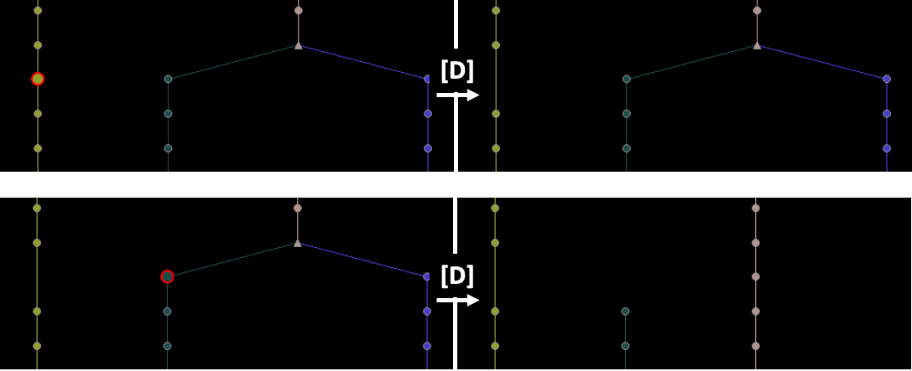
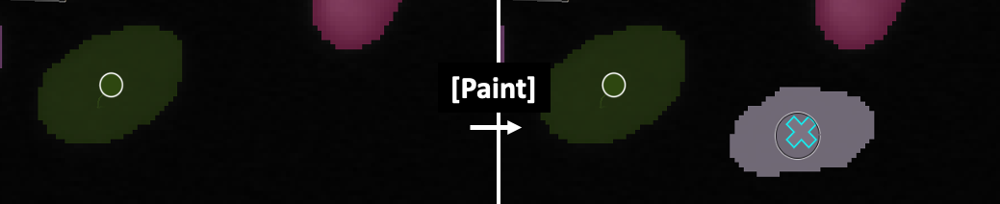
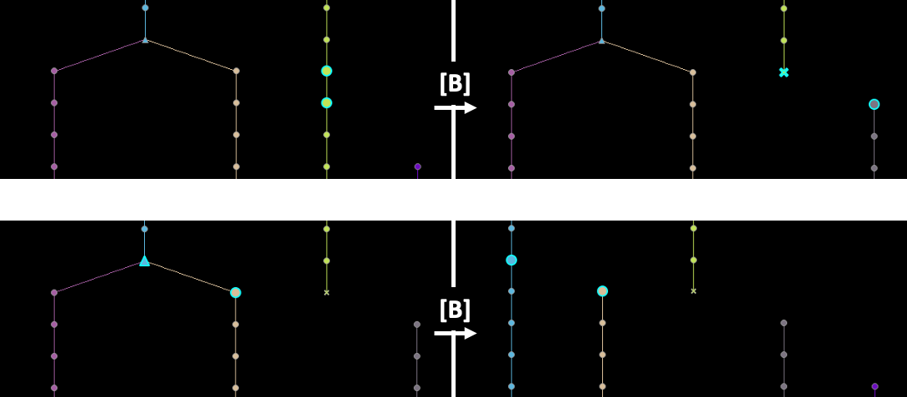
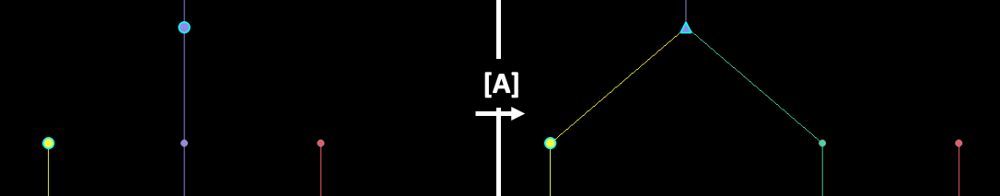

Editing Tracks
==============

Usage Overview
**************
Predicted tracks can be corrected by deleting, adding, or modifying nodes and/or edges, using the buttons in the 'Edit Tracks' widget or their corresponding keyboard shortcuts, or by editing the napari Points and Segmentation layers directly.

Editing nodes
*************

.. _delete-node:

Deleting nodes
---------------
Nodes can be deleted by selecting one or multiple nodes and clicking the 'Delete' button in the Edit Tracks menu or pressing ``D`` or ``Delete`` on the keyboard.
Deletion of a node results in its removal from the tree view and removal of its corresponding point and segmentation label in the Points and Segmentation napari layers.
If the node was connected to a predecessor and a successor, a new skip edge will be formed between the predecessor and successor nodes, leaving the remaining track intact.
If one of the two children of a dividing node is deleted, the nodes of the remaining sibling are relabeled to match the track ID of the parent.

   Examples of deleting nodes. Deletion of a node in a linear track will create a skip edge (top), whereas deletion of one of the two children (green) of a dividing node will relabel the nodes of the remaining sibling (yellow), which is now part of the parent track (grey) (bottom).

.. _add-node:

Adding nodes
-------------
New nodes can be added in two ways:
    - by adding a new point in the Points layer. A new, non-connected endpoint node will be created at the clicked position. This node does not have a segmentation (yet), but this can be added by the user if needed.
    - by painting with a (new) label in the Segmentation layer. A new node will be created based on the painted pixels. If the label already exists in the Segmentation layer, it will automatically be connected to its predecessor and/or successor via (skip) edges. If the label does not yet exist, a new endpoint node is created.

   Add a new node by painting. Press ``M`` on the segmentation layer to select a new label color for painting.

Updating nodes
---------------
Node attributes (e.g. size, position) can be updated in two ways:
    - If the source layer for tracking was a Points layer and no segmentation was provided, the points can be repositioned by clicking the 'Select points' button in the Points layer menu and clicking and dragging points to their new location.
    - If a segmentation layer was provided, node position is determined by the centroid location of each label. Therefore, nodes cannot be repositioned by moving their corresponding points in the Points layer. Instead, nodes can be updated by painting and/or erasing their labels in the Segmentation layer, which will automatically update their position and size properties.

Editing edges
*************

Deleting edges
----------------
Edges can be deleted by selecting two connected nodes and clicking the 'Break' button in the Edit Tracks menu or by pressing ``B`` on the keyboard. In a linear track, deleting an edge will split the track in two fragments. The first fragment will retain the track ID of the source node,
while a new track ID is assigned to the fragment of the target node.

   Examples of breaking edges. In a linear track, breaking an edge will relabel the fragment of the target node (top). If an edge between a dividing node and one of its children is deleted, both fragments maintain their track ID but the remaining sibling (magenta) is relabeled since it is now part of the same track as the parent (cyan) (bottom).

Adding an edge
--------------
New edges can be added by selecting two non-horizontal nodes and clicking on the 'Add' button in the Edit Tracks menu or by pressing ``A`` on the keyboard. If the target node already has an incoming edge, the user will be prompted with the question whether the existing edge can be broken,
since a node in a lineage tree cannot have two incoming edges. Note that new edges are also added automatically in certain cases when a node is being added or removed (see :ref:`delete-node` and :ref:`add-node`).

   Adding an edge between two nodes, creating a new division point.

Undoing and redoing actions
***************************
All types of actions described above are appended to the Action History, and can be undone or redone. To undo, click 'Undo' in the Edit Tracks menu or by pressing ``Z``. Similarly, to redo an action, press 'Redo' in the Edit Tracks menu or ``R``.
